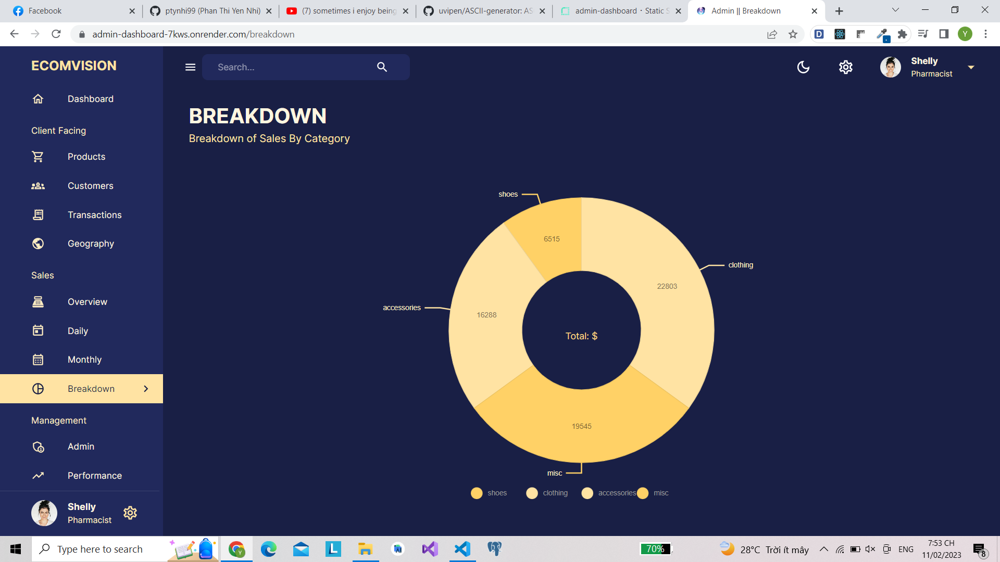

# [WEB] ADMIN DASHBOARD

## 🛠 Introduction

Here is my source code for website. With my code - This is my project during my studies: 
* **From the data stored in the database, the website supports the admin in statistical operations, Find where your users are located.**
* **Client Facing: can view detailed list and number of reviews for each product, list of customers, transactions and total transaction volume by region.**
* **Sales: Overview of general revenue and profit, Chart of daily, monthly sales, Breakdown of Sales By Category.**
* **Management: Managing admins and list of admins, Track your Affiliate Sales Performance.**

## 🛠 Languages:

 &nbsp;
 &nbsp;
 &nbsp;
 &nbsp;
 &nbsp;
 &nbsp;
 &nbsp;
 &nbsp;

## 🛠 Main pages of the website

### Dashboard page:

   
  <i>Dashboard page with Dark theme</i>

   
  <i>Dashboard page with Light theme</i>

### Products page:

   

   
  <i>Describe the function of Products page</i>

### Customers page:

   

   
  <i>Describe the function of Customers page</i>

### Transactions page:

   

   
  <i>Describe the function of Transactions page</i>

### Geography page:

   

   
  <i>Describe the function of Geography page</i>

### Overview page:

   

### Daily page:

   

   
  <i>Describe the function of Daily page</i>

### Monthly page:

   

### Breakdown page:

   

   
  <i>Describe the function of Breakdown page</i>

### Admin page:

   

### Performance page:

   

### Responsive web for mobile:

   

### Responsive web for tablet:

   

